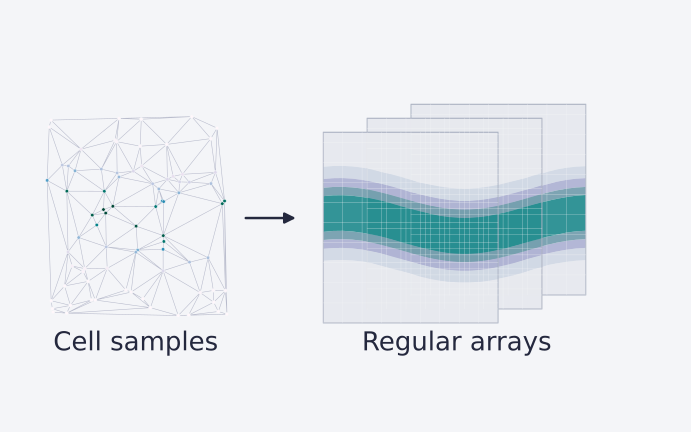

# OpenFOAM post-processing



Python utilities for reading OpenFOAM fields and resampling them onto regular NumPy grids. Originally published as **pyFoamPP**, the project uses fluidfoam for field access and local radial-basis interpolation for unstructured meshes.

## Quick start

Python 3.10 or newer is recommended.

```bash
git clone https://github.com/EngFlavioMartins/openfoam-postprocessing.git
cd openfoam-postprocessing
python -m venv .venv
source .venv/bin/activate
python -m pip install -r requirements.txt
python examples/plot_sample.py --output outputs/sample.svg
```

On Windows, activate with `.venv\Scripts\activate`. The example reads the bundled OpenFOAM snapshot directly and saves a velocity-sample plot. An OpenFOAM solver installation is not required to read it.

## Notebooks

```bash
python -m pip install jupyterlab
python -m jupyter lab
```

Open [Creating_Backups.ipynb](Creating_Backups.ipynb) to resample a case, or [Examples.ipynb](Examples.ipynb) to inspect processed fields. Run notebooks from the repository root.

For a new unstructured case, place it under `OFBackups/<case-name>/` and set its time, bounds and grid spacing:

```python
from Libs.Subroutines import preProcess

preProcess(
    "429", "OFData",
    structured=False,
    domain_bounds=(8, 14, 0.2, 2.5, 8, 12),
    grid_spacing=0.15,
)
```

This call reads velocity `U` and pressure `p`, then writes a binary mesh backup to `Data/OFData`. Choose bounds inside the useful part of your own case.

## Repository guide

| Location | Purpose |
| --- | --- |
| `Libs/Subroutines.py` | Loading, interpolation and mesh container |
| `examples/plot_sample.py` | Direct-from-OpenFOAM plotting example |
| `Creating_Backups.ipynb` | Case-to-array workflow |
| `Examples.ipynb` | Analysis examples |
| `OFBackups/OFData/` | Bundled OpenFOAM snapshot |
| `Data/` | Historical processed example |
| `docs/assets/header.svg` | Conceptual vector overview |

## Data and numerical scope

The resampler uses five neighbours and a linear RBF kernel. It is not conservative remapping and can extrapolate beyond the sampled domain. Check resolution, domain bounds and interpolation error before using the arrays quantitatively.

The original `structured=True` branch is incomplete; use the documented unstructured path. Its backup writer appends objects to an existing file, so use a fresh case name or move an old backup aside first. Only load pickle backups from trusted sources; the quick-start example avoids them.

## Contributing and attribution

See [CONTRIBUTING.md](CONTRIBUTING.md). Maintained by [Flavio Martins](https://engflaviomartins.github.io/).

Built on [fluidfoam](https://fluidfoam.readthedocs.io/) and [SciPy](https://docs.scipy.org/). The older README referred to MIT, but no licence file is present; no licence has been added or changed here.
